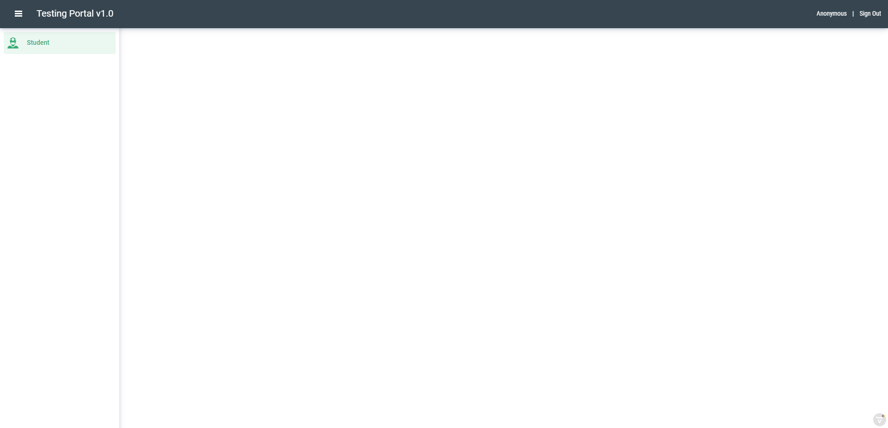

Creating a view in Graphenee Flow
=================================
Every class related to a view will be created inside ``/vaadin/`` folder.

MainLayout Class
----------------

.. code-block:: html
   :linenos:

   @Push
   public class MainLayout extends GxAbstractAppLayout {
   
      @Autowired
      GxAbstractFlowSetup flowSetup;

      @Override
      protected GxAbstractFlowSetup flowSetup() {
         return flowSetup;
      }
   }

HomeView Class
--------------

.. code-block:: html
   :linenos:

   @GxSecuredView
   @Route(value = "", layout = MainLayout.class)
   public class HomeView extends GxVerticalLayoutView {
      //any default component can be displayed
   }
   
LoginView Class
---------------

.. code-block:: html
   :linenos:

   @Route(value = "login")
   public class LoginView extends GxAbstractLoginView {

      @Autowired
      GxAbstractFlowSetup flowSetup;

      @Override
      protected GxAbstractFlowSetup flowSetup() {
         return flowSetup;
      }

      @Override
      protected GxAuthenticatedUser onLogin(LoginEvent event)
            throws AuthenticationFailedException, PasswordChangeRequiredException {
         return new MockUser();
      }
   }
   
FlowSetup Class
---------------

.. code-block:: html
   :linenos:

   @Component
   @VaadinSessionScope
   public class FlowSetup extends GxAbstractFlowSetup {

      @Override
      public List<GxMenuItem> menuItems() {
         List<GxMenuItem> items = new ArrayList<>();
         // we will add menu items later.
         return items;
      }

      @Override
      public Class<? extends RouterLayout> routerLayout() {
         return MainLayout.class;
      }

      @Override
      public String appTitle() {
         return "Testing Portal";
      }

      @Override
      public String appVersion() {
         return "1.0";
      }
   }
   
   
So, these were the base classes we needed to display views of different lists of our models. Now we will create a Student entity model and other classes related:
   
Entity Model
------------
   
.. code-block:: html
   :linenos:

   @Data
   @Entity
   @NoArgsConstructor
   @AllArgsConstructor
   @EqualsAndHashCode(onlyExplicitlyIncluded = true)
   @Table(name = "student")
   public class Student {
      @Id
      @Include
      @GeneratedValue(strategy = GenerationType.IDENTITY)
      private Integer oid;
      private String firstName;
      private String lastName;
      private String email;
   }

Entity Repository
-----------------

.. code-block:: html
   :linenos:

   public interface StudentRepository extends GxJpaRepository<Student, Integer> {
   }
   
Data Service
------------

.. code-block:: html
   :linenos:

   public interface StudentDataService {

      List<Student> findAll();

      void save(Student student);

      void deleteAll(Collection<Student> students);
   }
   
Data Service Implementation
---------------------------

.. code-block:: html
   :linenos:

   @Service
   public class StudentDataServiceImpl implements StudentDataService {

      @Autowired
      StudentRepository repository;

      @Override
      public List<Student> findAll() {
         return repository.findAll();
      }

      @Override
      public void save(Student student) {
         repository.save(student);
      }

      @Override
      public void deleteAll(Collection<Student> students) {
         repository.deleteAll(students);
      }
   }
   
After these, we will head towards creating listview for our Student model:

Student List View
-----------------

.. code-block:: html
   :linenos:

   @GxSecuredView(value = StudentListView.VIEW_NAME)
   public class StudentListView extends GxVerticalLayoutView {

      public static final String VIEW_NAME = "student";

      @Override
      public void afterNavigation(AfterNavigationEvent event) {
         super.afterNavigation(event);
      }

      @Override
      protected void decorateLayout(HasComponents rootLayout) {
         super.decorateLayout(rootLayout);
      }

      @Override
      protected String getCaption() {
         return "Students";
      }
   }

Now we have to add our view class into menu items of FlowSetup class:

.. code-block:: html
   :linenos:

   @Override
   public List<GxMenuItem> menuItems() {
      List<GxMenuItem> items = new ArrayList<>();
      items.add(GxMenuItem.create("Student", VaadinIcon.SPECIALIST.create(), StudentListView.class));
      return items;
   }

Our Web will look like:

Student List/Grid
-----------------

.. code-block:: html
   :linenos:

   @Component
   @Scope("prototype")
   public class StudentList extends GxAbstractEntityList<Student> {

      @Autowired
      StudentDataService service;

      public StudentList() {
         super(Student.class);
      }

      @Override
      protected Stream<Student> getData() {
         return service.findAll().stream();
      }

      @Override
      protected GxAbstractEntityForm<Student> getEntityForm(Student arg0) {
         return null; // we will add it later
      }

      @Override
      protected void onDelete(Collection<Student> companies) {
         service.deleteAll(companies);
      }

      @Override
      protected void onSave(Student company) {
         service.save(company);
      }

      @Override
      protected String[] visibleProperties() {
         return new String[] { "firstName", "lastName", "email" };
      }
   }
   
As we have created Student List, we will autowire it into Student List View class. So, the methods below will be updated:

.. code-block:: html
   :linenos:
   
   @Override
   StudentList list;

   @Override
   public void afterNavigation(AfterNavigationEvent event) {
      list.refresh();
   }

   @Override
   protected void decorateLayout(HasComponents rootLayout) {
      rootLayout.add(list);
   }

Student Form
------------

.. code-block:: html
   :linenos:

   @Component
   @Scope("prototype")
   public class StudentForm extends GxAbstractEntityForm<Student> {

      TextField firstName;
      TextField lastName;
      TextField email;

      public StudentForm() {
         super(Student.class);
      }

      @Override
      protected void decorateForm(HasComponents form) {
         firstName = new TextField("First Name");
         lastName = new TextField("Last Name");
         email = new TextField("Email");
         form.add(firstName, lastName, email);
      }

      @Override
      protected void bindFields(Binder<Student> dataBinder) {
         dataBinder.forMemberField(firstName).asRequired();
         dataBinder.forMemberField(lastName).asRequired();
         dataBinder.forMemberField(email).asRequired();
      }
   }
   
After creating the form, we will autowire form into Student list and update our getEntityForm method:

.. code-block:: html
   :linenos:

   @Autowired
   StudentForm form;
    
   @Override
   protected GxAbstractEntityForm<Student> getEntityForm(Student arg0) {
      return form;
   }
