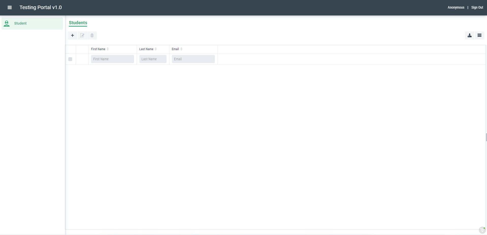
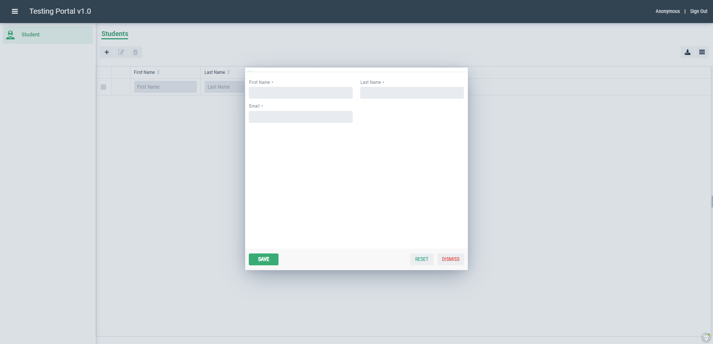

Creating a view in Graphenee Flow
=================================
Every class related to a view will be created inside ``/vaadin/`` folder.

MainLayout Class
----------------

.. code-block:: html
   :linenos:

   @Push
   public class MainLayout extends GxAbstractAppLayout {
   
      @Autowired
      GxAbstractFlowSetup flowSetup;

      @Override
      protected GxAbstractFlowSetup flowSetup() {
         return flowSetup;
      }
   }
- @Push - When you need to update a UI from another UI, possibly of another user, or from a background thread running in the server, you usually want to have the update show immediately, not when the browser happens to make the next server request. For this purpose, you can use server push that sends the data to the browser immediately. Push is based on a client-server connection, usually a WebSocket connection, that the client establishes and the server can then use to send updates to the client.

HomeView Class
--------------

.. code-block:: html
   :linenos:

   @GxSecuredView
   @Route(value = "", layout = MainLayout.class)
   public class HomeView extends GxVerticalLayoutView {
      //any default component can be displayed
   }
- @GxSecuredView - This annotation ensures that this view will only be accessed / visible to an authenticated user.
- @Route - Vaadin provides the Router class to structure the navigation of your web application into logical parts.The router takes care of serving content when the user navigates within an application. It includes support for nested routes, access to route parameters, and more. You can use the @Route annotation to define any component as a route target for a given URL fragment.
   
LoginView Class
---------------

.. code-block:: html
   :linenos:

   @Route(value = "login")
   public class LoginView extends GxAbstractLoginView {

      @Autowired
      GxAbstractFlowSetup flowSetup;

      @Override
      protected GxAbstractFlowSetup flowSetup() {
         return flowSetup;
      }

      @Override
      protected GxAuthenticatedUser onLogin(LoginEvent event)
            throws AuthenticationFailedException, PasswordChangeRequiredException {
         return new MockUser();
      }
   }
- onLogin() method will be triggered when user presses the Login Button.Here we return the MockUser() which will give us an Anonymous user to log in to the app.
But if we want to return a user using credentials, we will update LoginView class as below: 

.. code-block:: html
   :linenos:

   @Autowired
   GxDataService dataService;
    
   @Override
   protected GxAuthenticatedUser onLogin(LoginEvent event) throws AuthenticationFailedException, PasswordChangeRequiredException {
         String userName = event.getUsername();
         String password = event.getPassword();
         GxUserAccountBean user = dataService.findUserAccountByUsernamePasswordAndNamespace(userName, password, namespace);
         return new GxDashboardUser(user);
      }
   
FlowSetup Class
---------------

.. code-block:: html
   :linenos:

   @Component
   @VaadinSessionScope
   public class FlowSetup extends GxAbstractFlowSetup {

      @Override
      public List<GxMenuItem> menuItems() {
         List<GxMenuItem> items = new ArrayList<>();
         // we will add menu items later.
         return items;
      }

      @Override
      public Class<? extends RouterLayout> routerLayout() {
         return MainLayout.class;
      }

      @Override
      public String appTitle() {
         return "Testing Portal";
      }

      @Override
      public String appVersion() {
         return "1.0";
      }
   }
- @Component - @Component is an annotation that allows Spring to automatically detect our custom beans.
- @VaadinSessionScope - The @VaadinSessionScope annotation manages the Spring beans during the Vaadin session lifecycle. It ensures that the same bean instance is used during the whole Vaadin session.
   
So, these were the base classes we needed to display views of different lists of our models. Now we will create a Student entity model and other classes related:
   
Entity Model
------------
   
.. code-block:: html
   :linenos:

   @Data
   @Entity
   @NoArgsConstructor
   @AllArgsConstructor
   @EqualsAndHashCode(onlyExplicitlyIncluded = true)
   @Table(name = "student")
   public class Student {
      @Id
      @Include
      @GeneratedValue(strategy = GenerationType.IDENTITY)
      private Integer oid;
      private String firstName;
      private String lastName;
      private String email;
   }
- @Data - This @Data annotation gives us the getters and setters for our model.
- @Entity - The @Entity annotation specifies that the class is an entity and is mapped to a database table.
- @NoArgsConstructor - This annotation will create default constructor for our model.
- @AllArgsConstructor - This annotation will create constructor having all the arguments.
- @EqualsAndHashCode - When we declare a class with @EqualsAndHashCode, Lombok generates implementations for the equals and hashCode methods.
- @Id - This annotation will indicate the primary key.

Entity Repository
-----------------

.. code-block:: html
   :linenos:

   public interface StudentRepository extends GxJpaRepository<Student, Integer> {
   }
- JpaRepository is a JPA (Java Persistence API) specific extension of Repository. It contains the full API of CrudRepository and PagingAndSortingRepository. So it contains API for basic CRUD operations and also API for pagination and sorting.
   
Data Service
------------

.. code-block:: html
   :linenos:

   public interface StudentDataService {

      List<Student> findAll();

      void save(Student student);

      void deleteAll(Collection<Student> students);
   }
We will declare the some crud methods to be implemented.
   
Data Service Implementation
---------------------------

.. code-block:: html
   :linenos:

   @Service
   public class StudentDataServiceImpl implements StudentDataService {

      @Autowired
      StudentRepository repository;

      @Override
      public List<Student> findAll() {
         return repository.findAll();
      }

      @Override
      public void save(Student student) {
         repository.save(student);
      }

      @Override
      public void deleteAll(Collection<Student> students) {
         repository.deleteAll(students);
      }
   }
Repository class will be used in implementation of service methods.
   
After these, we will head towards creating listview for our Student model:

Student List View
-----------------

.. code-block:: html
   :linenos:

   @GxSecuredView(value = StudentListView.VIEW_NAME)
   public class StudentListView extends GxVerticalLayoutView {

      public static final String VIEW_NAME = "student";

      @Override
      public void afterNavigation(AfterNavigationEvent event) {
         super.afterNavigation(event);
      }

      @Override
      protected void decorateLayout(HasComponents rootLayout) {
         super.decorateLayout(rootLayout);
      }

      @Override
      protected String getCaption() {
         return "Students";
      }
   }
- afterNavigation() method will be invoked when we tap on menu item for this view. i.e Student.
- decorateLayout() method will be used to add components to root layout.
- getCaption() will set the title for this view.

Now we have to add our view class into menu items of FlowSetup class:

.. code-block:: html
   :linenos:

   @Override
   public List<GxMenuItem> menuItems() {
      List<GxMenuItem> items = new ArrayList<>();
      items.add(GxMenuItem.create("Student", VaadinIcon.SPECIALIST.create(), StudentListView.class));
      return items;
   }

Our Web application will look like:

.. image:: images/listview.png
 :width: 600

Student List/Grid
-----------------

.. code-block:: html
   :linenos:

   @Component
   @Scope("prototype")
   public class StudentList extends GxAbstractEntityList<Student> {

      @Autowired
      StudentDataService service;

      public StudentList() {
         super(Student.class);
      }

      @Override
      protected Stream<Student> getData() {
         return service.findAll().stream();
      }

      @Override
      protected GxAbstractEntityForm<Student> getEntityForm(Student arg0) {
         return null; // we will add it later
      }

      @Override
      protected void onDelete(Collection<Student> companies) {
         service.deleteAll(companies);
      }

      @Override
      protected void onSave(Student company) {
         service.save(company);
      }

      @Override
      protected String[] visibleProperties() {
         return new String[] { "firstName", "lastName", "email" };
      }
   }
- @Scope - This annotation defines the life cycle and visibility of that bean in the contexts we use it.
- We will inject our service here to use crud methods.
- visibleProperties() - In this method, we will specify the columns that will be displayed in list. Column names here must match with attribute names of model.

As we have created Student List, we will autowire it into Student List View class. So, the methods below will be updated:

.. code-block:: html
   :linenos:
   
   @Override
   StudentList list;

   @Override
   public void afterNavigation(AfterNavigationEvent event) {
      list.refresh();
   }

   @Override
   protected void decorateLayout(HasComponents rootLayout) {
      rootLayout.add(list);
   }
   
After this, when we tap on Student menu item, list/grid will be displayed:

Student Form
------------

.. code-block:: html
   :linenos:

   @Component
   @Scope("prototype")
   public class StudentForm extends GxAbstractEntityForm<Student> {

      TextField firstName;
      TextField lastName;
      TextField email;

      public StudentForm() {
         super(Student.class);
      }

      @Override
      protected void decorateForm(HasComponents form) {
         firstName = new TextField("First Name");
         lastName = new TextField("Last Name");
         email = new TextField("Email");
         form.add(firstName, lastName, email);
      }

      @Override
      protected void bindFields(Binder<Student> dataBinder) {
         dataBinder.forMemberField(firstName).asRequired();
         dataBinder.forMemberField(lastName).asRequired();
         dataBinder.forMemberField(email).asRequired();
      }
   }
   
After creating the form, we will autowire form into Student list and update our getEntityForm method:

.. code-block:: html
   :linenos:

   @Autowired
   StudentForm form;
    
   @Override
   protected GxAbstractEntityForm<Student> getEntityForm(Student arg0) {
      return form;
   }
   
We can open the form using ``+`` button on top-left:

 You can fill the fields and save records using SAVE button.
