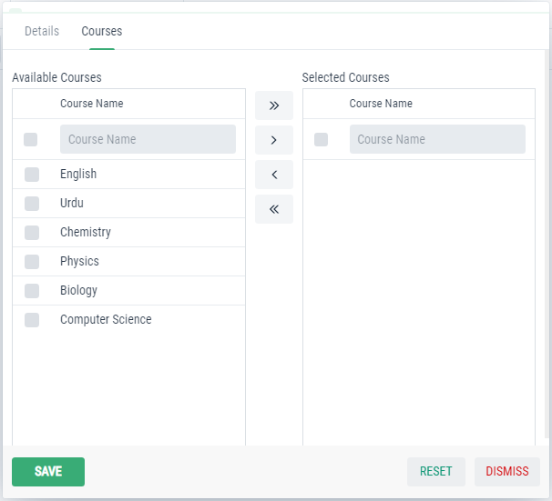

Customize Components
====================

Adding tabs to form
-------------------
In the StudentForm, we wil override a method to add tabs and components:

.. code-block:: html
   :linenos:
    
   @Override
   protected void addTabsToForm(List<GxTabItem> tabItems) {
      tabItems.add(GxTabItem.create(1, "Other Tab", email));
   }

.. image:: images/tab.png
 :width: 600

Here, we will add GxTabItem to tabItems list in method. GxTabItem will take 3 parameters i.e. index,tab name and component.

Adding TwinColGrid
-------------------
In the Courses Tab of StudentForm, we wil add our TwinColGrid component:

.. code-block:: html
   :linenos:
   
   @Autowired
   CourseDataService courseDataService;
   
   TwinColGrid<Course> courses;
       
   courses = new TwinColGrid<Course>()
         .addFilterableColumn(Course::getCourseName, "Course Name", "Course Name", true)
         .withLeftColumnCaption("Available Courses").withRightColumnCaption("Selected Courses");
                
   @Override
   protected void addTabsToForm(List<GxTabItem> tabItems) {
      tabItems.add(GxTabItem.create(1, "Courses", courses));
   }
   
   @Override
    protected void preBinding(Student entity) {
        courses.setItems(courseDataService.findAll().stream());
        courses.setSizeFull();
        courses.getElement().getStyle().set("display", "block");
    }

