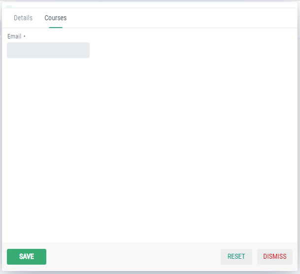

Customize Components
====================

Adding tabs to form
-------------------
In the StudentForm, we wil override a method to add tabs and components:

.. code-block:: html
   :linenos:
    
   @Override
   protected void addTabsToForm(List<GxTabItem> tabItems) {
      tabItems.add(GxTabItem.create(1, "Other Tab", email));
   }

