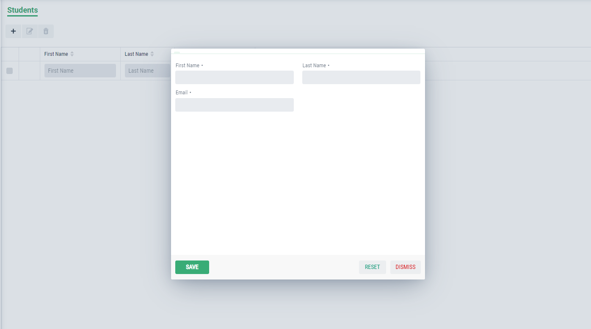

Form Customization
==================

To create a from, we will create our form class and extend it with GxAbstractEntityForm and use our model as form type. After that, we will create form by overrriding the methods provided by GxAbstractEntityForm class.

Here we will discuss about different methods that are being used for customizing forms in graphenee.

- closeDialog() - Used to close the form dialog.
- customizeSaveButton() - Used to implement any change in save button.
- decorateToolbar() - Used to customize toolbar.
- defaultTabTitle() - Used to set the default tab title.
- dialogWidth() - Used to set the dialog width.
- dialogHeight() - Used to set the dialog height.
- formTitle() - Used to set the form title.
- formTitleProperty() - Used to set any property as form title.
- getEntity() - Used to get the current entity, the form is displaying.
- getFormComponent() - Used to get any component of form.
- getToolbarComponent() - Used to get any toolbar component.
- isEditable() - Used to get boolean i.e. form is editable or not.
- isEntityBound() - Used to get boolean, i.e. entity is bound or not.
- onTabChange() - This method will be invoked on every tab change.
- postBinding() - This method will be invoked after form binding.
- setColspan() - Used to set the column span for given component.
- setDialogAutoClose() - Used to set boolean for auto closing of form.
- setEditable() - Used to set boolean for edititng form.
- setEntity() - Used to set the given entity as current entity.
- setTabEnabled() - Used to enable any given tab.
- shouldFocusFirstFieldOnShow() - Used to get boolean to focus first field whenever form opens.
- validateForm() - Used to apply the validations to fields.
