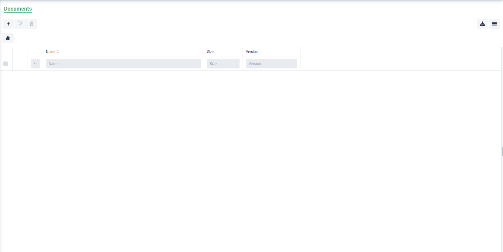

Document Management Module in Graphenee Flow
============================================

Adding Document Module in FlowSetup
-----------------------------------

First of all, we will add document menu item class in FlowSetup class.

.. code-block:: html
   :linenos:

   @Override
   public List<GxMenuItem> menuItems() {
      items.add("Document", VaadinIcon.BOOK.create(), GxDocumentExplorerView.class);
      return items;
   }
   
After that, this type of view will be created.

