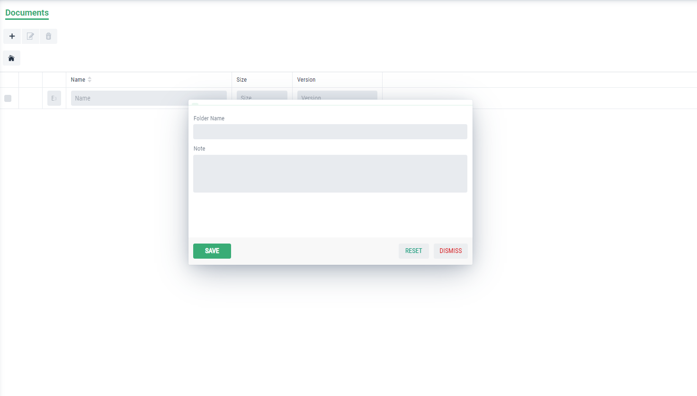
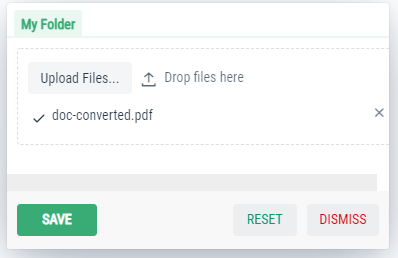
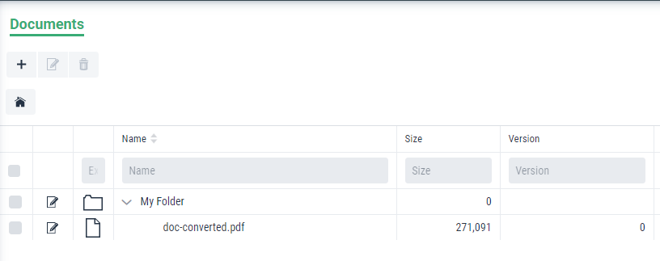

Document Management Module in Graphenee Flow
============================================

Adding Document Module in FlowSetup
-----------------------------------

First of all, we will add document menu item class in FlowSetup class.

.. code-block:: html
   :linenos:

   @Override
   public List<GxMenuItem> menuItems() {
      items.add("Document", VaadinIcon.BOOK.create(), GxDocumentExplorerView.class);
      return items;
   }
   
After that, this type of view will be created.

.. image:: images/doc.png

Now, we will have to get storage access. For that purpose, we will create two more files i.e. ApplicationConfiguration and ApplicationPropertiesBean.

ApplicationConfiguration Class
------------------------------

.. code-block:: html
   :linenos:

   @Slf4j
   @Configuration
   public class ApplicationConfiguration {

      @Value("${gx.fs-base-path}")
      String fileSystemBasePath;

      @Value("${gx.storage-type}")
      String storageType;

      @Bean
      public ApplicationPropertiesBean applicationProperties() {
         ApplicationPropertiesBean bean = new ApplicationPropertiesBean();
         if (fileSystemBasePath == null) {
            bean.setFileSystemBasePath(System.getProperty("user.home") + File.separator + ".qalab");
         } else {
            if (fileSystemBasePath.startsWith("~"))
               fileSystemBasePath = fileSystemBasePath.replace("~", System.getProperty("user.home"));
               bean.setFileSystemBasePath(fileSystemBasePath);
         }
         return bean;
      }

      @Bean
      @ConditionalOnProperty(prefix = "gx", name = "storage-type", havingValue = "local")
      public FileStorage localFileStorage() {
         log.info(applicationProperties().getFileSystemBasePath());
         File rootFolder = new File(applicationProperties().getFileSystemBasePath());
         return FileStorageFactory.createLocalFileStorage(rootFolder);
      }
   }
   
   
ApplicationPropertiesBean Class
-------------------------------

.. code-block:: html
   :linenos:

   @Getter
   @Setter
   public class ApplicationPropertiesBean {
      private String fileSystemBasePath;
   }

and its done. Click on ``+`` button to create new folder like this:

and then double click to open the folder and again click ``+`` button to upload document. After that, hit Save.

After all of these, we will have have a final look like this. Here we can create nested folders and upload files to any level.

