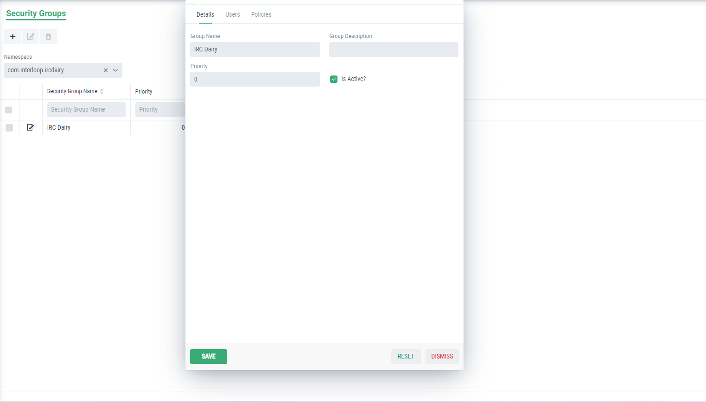
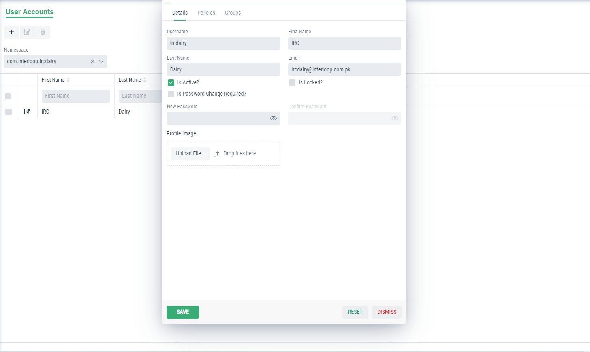

Security Module in Graphenee Flow
=================================

In the security module, we create different users, their groups in which they are categorized and also the policies for these groups.

Add Security to Menu Items
--------------------------

First of all, we will add security menu item in FlowSetup class.

.. code-block:: html
   :linenos:

   @Override
   public List<GxMenuItem> menuItems() {
      items.add(GxMenuItemFactory.securityMenuItem());
      return items;
   }

.. image:: images/secmenu.png

Creating Policies
-----------------

After that, we will create policy.
Here, we will set the name and then move toward statements. In statements, views will be granted or revoked. You can assign Users and Groups on other tabs if you have already created them.

.. image:: images/policy.png
 :width: 600
 
Creating Group
--------------
 
Then, we will create group.
Here, we will set the name for the group and assign the policy that we have recently created, in Policies tab.
 

 
Creating User
-------------
 
At last, we will create the user.
Here, we will set the credentials for our user and then we will select the related group and policy from other tabs.
 

