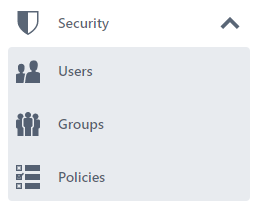
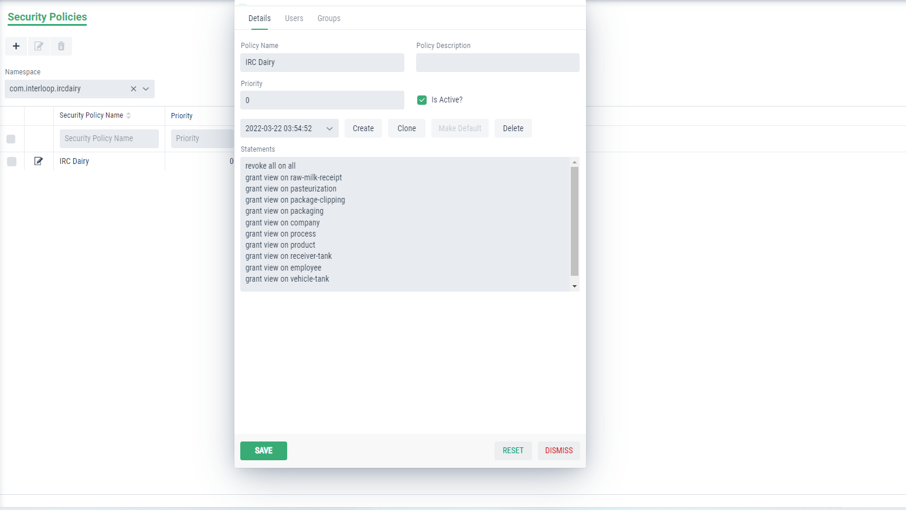

Security Module in Graphenee Flow
=================================

In the security module, we create different users, their groups in which they are categorized and also the policies for these groups.

Add Security to Menu Items
--------------------------

First of all, we will add security menu item in FlowSetup class.

.. code-block:: html
   :linenos:

   @Override
   public List<GxMenuItem> menuItems() {
      items.add(GxMenuItemFactory.securityMenuItem());
      return items;
   }

Creating Policies
-----------------

 
 Creating Group
 --------------
 
 .. image:: images/group.png
 :width: 600
 
 Creating User
 -------------
 
 .. image:: images/user.png
 :width: 600
